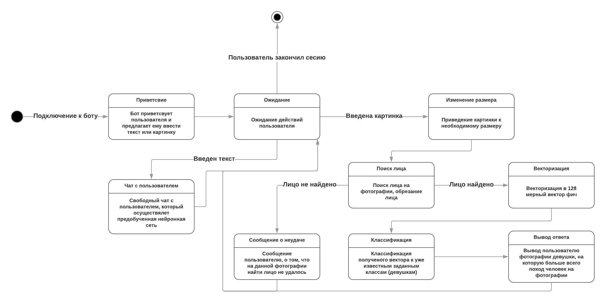

# Project: Telegram-chat-bot with face recognition model
## Instalation Steps
1. Clone repo
2. pip install requirements.txt
3. Open terminal, run: python bot_prep.py
   1. if the environment is ok, it shows model initialisation message. Bot is ready to use
   2. Go to the Telegram, find user Comparator3000bot. If there wasn't any mistake bot answers you.

**Authors CLeDoPbIT, Northengard**

### State diagram
